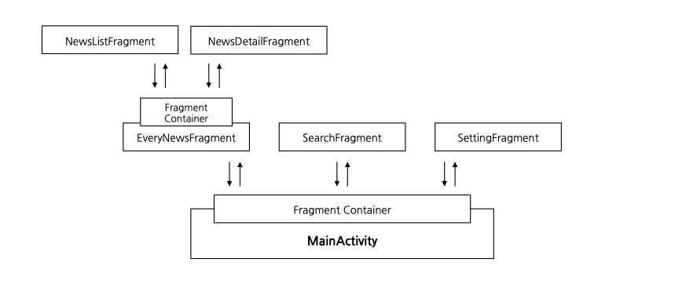

# AmazingNews

## 배경
정보가 쏟아져나오는 세상 속에서 현 시대인들은 스마트폰을 통해 원하는 혹은 새로운 정보를 접하고 있다. 특히 과거부터 오랫동안 우리에게 정보를 전달해준 뉴스의 경우 이런 흐름에 맞춰 스마트폰을 통해 정보를 전달하고 있으며, 이에 따라 다양한 플랫폼이 등장하게 되었다.

이러한 신문, 뉴스를 접하기 위해서는 특정 회사의 플랫폼을 사용하기도 하지만 네이버 뉴스, Google News 등 다양한 회사의 뉴스를 제공하는 서비스가 등장하였다. (이하 통합 플랫폼) 이를 참고하여 Android의 다양한 기술을 기반으로 하나의 어플리케이션에서 다양한 뉴스를 확인할 수 있으며 기존 플랫폼의 아쉬웠던 점을 개선하고, 사용자의 요구에 충족할 수 있는 어플리케이션을 제작한다.

## 스킬
* Android (Kotlin)
    * MVVM, Paging3, Retrofit2

## 구조도
* Fragment Structure
  

## 기능 설명
* 기능은 크게 2가지로 나눠진다.
  * 현재 뉴스
  * 특정 키워드를 포함한 뉴스
* 현재 뉴스의 경우 특정 혹은 다양한 플랫폼을 통해 발행된 뉴스를 전달한다.
* 특정 키워드를 포함한 뉴스의 경우 현재 뉴스에서 특정 키워드가 포함된 뉴스를 전달한다.

## 기타
* 해당 어플리케이션을 제작할 때 활용할 API는 [NewsAPI](https://newsapi.org/)를 활용한다.
* 해당 프로젝트에서 활용할 Git 규칙은 아래와 같다.
    * 모든 메시지는 `Type: Message` 형태를 가진다.
        | Type | 설명 |
        |  --  |  --  |
        | feat |  신규 기능이 추가 되었을 때 활용   |
        | refact |  기존 코드 리팩토링 작업 시 활용  |
        | fix  |  기존 기능의 문제점을 수정하였을 때 활용  |
        | docs  |  코드에 직접적으로 영향을 주지 않는 영역에 활용 (README 등))  |
        